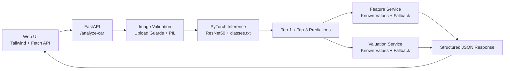

# Car Vision Project

[](https://www.python.org/)
[](https://pytorch.org/)
[](https://fastapi.tiangolo.com/)
[](https://tailwindcss.com/)
[](https://www.docker.com/)
[](LICENSE)

Production-ready computer vision system for Turkish car market recognition.

This repository combines a custom-trained PyTorch `ResNet50`, a FastAPI inference API, and a modern Tailwind-based web UI to identify vehicles from exterior photos and enrich the result with feature and valuation data.

## Why This Repo Is Different

- Custom-trained model for **105 Turkish market make/model/year classes**
- **60%+ Top-1 accuracy** on the current trained checkpoint
- Browser UI at `/` plus API endpoints for integration use
- Top-3 predictions with confidence bars
- Fallback feature and valuation responses so the API does not break on unmapped classes
- Docker-ready, testable, and organized as an installable Python package

## System Flow



## Repository Layout

```text
FastModel/
|-- README.md
|-- LICENSE
|-- pyproject.toml
|-- .gitignore
|-- init_repo.ps1
`-- car_vision_project/
    |-- api/
    |-- artifacts/
    |-- data/
    |-- models/
    |-- scripts/
    |-- services/
    |-- templates/
    |-- tests/
    |-- utils/
    |-- .env.example
    |-- Dockerfile
    |-- README.md
    |-- requirements.txt
    |-- config.py
    `-- train.py
```

## Quick Start

From the repository root:

```bash
python -m venv .venv
```

Activate the environment:

```bash
# Windows PowerShell
.venv\Scripts\Activate.ps1

# macOS / Linux
source .venv/bin/activate
```

Install dependencies:

```bash
python -m pip install --upgrade pip
pip install -r car_vision_project/requirements.txt
pip install -e .
```

Create a local environment file:

```bash
copy car_vision_project\.env.example .env
```

## Model Checkpoint Note

The repository intentionally tracks `classes.txt` but does **not** version the trained `.pth` weight file.

To run full inference locally, place your checkpoint here:

```text
car_vision_project/artifacts/best_car_model.pth
```

Or point the API to another checkpoint with:

```text
MODEL_CHECKPOINT_PATH=...
```

If the checkpoint is missing:

- `GET /health` will report `model_loaded: false`
- `POST /analyze-car` will return a model availability error until weights are provided

## Run Locally

```bash
uvicorn car_vision_project.api.main:app --host 0.0.0.0 --port 8000 --reload
```

Open:

- [http://127.0.0.1:8000](http://127.0.0.1:8000)
- [http://127.0.0.1:8000/docs](http://127.0.0.1:8000/docs)

## Run With Docker

Build:

```bash
docker build -f car_vision_project/Dockerfile -t car-vision-api .
```

Run:

```bash
docker run --rm ^
  -p 8000:8000 ^
  --env-file .env ^
  -v "%CD%\car_vision_project\artifacts:/app/car_vision_project/artifacts:ro" ^
  car-vision-api
```

## API Snapshot

### `GET /health`

```json
{
  "status": "ok",
  "model_loaded": true,
  "classes_loaded": 105,
  "checkpoint_path": "car_vision_project/artifacts/best_car_model.pth",
  "classes_path": "car_vision_project/artifacts/classes.txt"
}
```

### `POST /analyze-car`

Request type:

```text
multipart/form-data
```

Example request:

```bash
curl -X POST "http://127.0.0.1:8000/analyze-car" ^
  -H "accept: application/json" ^
  -F "file=@C:\path\to\car.jpg;type=image/jpeg"
```

Example response:

```json
{
  "prediction": {
    "make": "Honda",
    "model": "Civic Fc5",
    "year": 2019,
    "class_label": "honda_civic_fc5_2019",
    "confidence": 0.4295
  },
  "top_predictions": [
    {
      "make": "Honda",
      "model": "Civic Fc5",
      "year": 2019,
      "class_label": "honda_civic_fc5_2019",
      "confidence": 0.4295
    },
    {
      "make": "Honda",
      "model": "Civic",
      "year": 2020,
      "class_label": "honda_civic_2020",
      "confidence": 0.2411
    },
    {
      "make": "Toyota",
      "model": "Corolla",
      "year": 2021,
      "class_label": "toyota_corolla_2021",
      "confidence": 0.1124
    }
  ],
  "features": {
    "body_type": "Passenger Vehicle",
    "engine": "Not available in mock catalog",
    "horsepower_hp": "Unknown",
    "transmission": "Unknown",
    "fuel_type": "Unknown",
    "drivetrain": "Unknown",
    "estimated_vehicle_age_years": 7,
    "data_source": "generic fallback for Honda Civic Fc5"
  },
  "valuation": {
    "currency": "USD",
    "current_market_value": 23400.0,
    "second_hand_market_value": 19188.0,
    "mileage_assumption_km": 105000,
    "source": "generic_fallback_for_honda_civic_fc5"
  }
}
```

## Testing

```bash
pytest car_vision_project/tests
```

## More Detail

The package-level technical documentation lives here:

- [Detailed Project README](car_vision_project/README.md)

## License

MIT. See [LICENSE](LICENSE).
