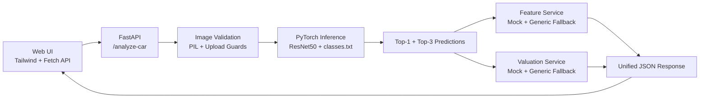

# Car Vision Project

[](https://www.python.org/)
[](https://pytorch.org/)
[](https://fastapi.tiangolo.com/)
[](https://tailwindcss.com/)
[](https://www.docker.com/)
[](#license)

Production-ready computer vision system for **Turkish car market recognition**.  
The project combines a **custom-trained PyTorch ResNet50 model**, a **FastAPI inference API**, and a **modern Tailwind-based web UI** to identify vehicles from exterior photos and enrich the prediction with technical feature and valuation data.

## Project Overview

This repository was built as an end-to-end MLOps-style vision product, not just a notebook experiment.

Highlights:

- Custom-trained **ResNet50** classifier for the Turkish car market
- **105 vehicle classes** derived from real-world make/model/year folders
- **60%+ Top-1 accuracy** on the current trained model
- FastAPI backend with `/health`, `/analyze-car`, and browser UI at `/`
- TailwindCSS drag-and-drop frontend with image preview and live results cards
- Top-3 ranked predictions with confidence bars
- Robust fallback logic so feature and valuation lookups **never fail** for unseen classes
- Dockerized deployment and editable local package install
- Test coverage for API behavior, top-k predictions, and fallback services

## Demo Architecture



## Core Capabilities

- **Vehicle Recognition**  
  Accepts an uploaded exterior car image and predicts the most likely class label.

- **Top-K Inference**  
  Returns the primary prediction plus the **Top-3 predictions** with calibrated confidence scores.

- **Graceful Fallbacks**  
  If a predicted class is not present in the mock feature or valuation dictionaries, the system returns a generic response instead of failing.

- **Flask-Friendly Exports**  
  The training pipeline exports:
  - `best_car_model.pth`
  - `classes.txt`
  - `training_curves.png`
  - `confusion_matrix.png`
  - `training_summary.json`

## Repository Structure

```text
car_vision_project/
|-- api/
|   `-- main.py
|-- artifacts/
|   |-- best_car_model.pth
|   `-- classes.txt
|-- data/
|-- models/
|   `-- car_classifier.py
|-- scripts/
|   `-- auto_scraper.py
|-- services/
|   |-- feature_service.py
|   `-- valuation_service.py
|-- templates/
|   `-- index.html
|-- utils/
|   `-- image_transforms.py
|-- .env.example
|-- Dockerfile
|-- README.md
|-- requirements.txt
`-- train.py
```

## Model Artifacts

Current production-oriented inference setup:

- Weights: `car_vision_project/artifacts/best_car_model.pth`
- Labels: `car_vision_project/artifacts/classes.txt`
- Class count: **105**
- Inference input size: **224x224**

The API loads the class list from `classes.txt` in alphabetical order and maps inference indices directly to class labels.

## Local Installation

From the repository root:

```bash
python -m venv .venv
```

Activate the environment:

```bash
# Windows PowerShell
.venv\Scripts\Activate.ps1

# macOS / Linux
source .venv/bin/activate
```

Install dependencies:

```bash
python -m pip install --upgrade pip
pip install -r car_vision_project/requirements.txt
pip install -e .
```

Create a local environment file:

```bash
copy car_vision_project\.env.example .env
```

or on macOS/Linux:

```bash
cp car_vision_project/.env.example .env
```

Run the API locally:

```bash
uvicorn car_vision_project.api.main:app --host 0.0.0.0 --port 8000 --reload
```

Open the UI:

- [http://127.0.0.1:8000](http://127.0.0.1:8000)

## Docker Run

Build:

```bash
docker build -f car_vision_project/Dockerfile -t car-vision-api .
```

Run:

```bash
docker run --rm ^
  -p 8000:8000 ^
  --env-file .env ^
  -v "%CD%\\car_vision_project\\artifacts:/app/car_vision_project/artifacts:ro" ^
  car-vision-api
```

PowerShell version:

```powershell
docker run --rm `
  -p 8000:8000 `
  --env-file .env `
  -v "${PWD}\car_vision_project\artifacts:/app/car_vision_project/artifacts:ro" `
  car-vision-api
```

## Configuration

Important environment variables:

```text
API_HOST=0.0.0.0
API_PORT=8000
UVICORN_WORKERS=1
CORS_ALLOWED_ORIGINS=
MODEL_CHECKPOINT_PATH=car_vision_project/artifacts/best_car_model.pth
MODEL_CLASSES_PATH=car_vision_project/artifacts/classes.txt
MODEL_NUM_CLASSES=105
MODEL_IMAGE_SIZE=224
MODEL_DEVICE=auto
MODEL_DROPOUT=0.3
TEMPLATES_DIR=car_vision_project/templates
STATIC_DIR=car_vision_project/static
MAX_UPLOAD_SIZE_MB=10
ALLOWED_IMAGE_CONTENT_TYPES=image/jpeg,image/png,image/webp
```

## API Documentation

### `GET /health`

Health and model readiness probe.

Example response:

```json
{
  "status": "ok",
  "model_loaded": true,
  "classes_loaded": 105,
  "checkpoint_path": "car_vision_project/artifacts/best_car_model.pth",
  "classes_path": "car_vision_project/artifacts/classes.txt"
}
```

### `POST /analyze-car`

Analyze an uploaded image and return prediction, top-k inference, features, and valuation.

Request type:

```text
multipart/form-data
```

Field:

```json
{
  "file": "binary image file"
}
```

Example request:

```bash
curl -X POST "http://127.0.0.1:8000/analyze-car" ^
  -H "accept: application/json" ^
  -F "file=@C:\\path\\to\\car.jpg;type=image/jpeg"
```

Successful response:

```json
{
  "prediction": {
    "make": "Honda",
    "model": "Civic Fc5",
    "year": 2019,
    "class_label": "honda_civic_fc5_2019",
    "confidence": 0.4295
  },
  "top_predictions": [
    {
      "make": "Honda",
      "model": "Civic Fc5",
      "year": 2019,
      "class_label": "honda_civic_fc5_2019",
      "confidence": 0.4295
    },
    {
      "make": "Honda",
      "model": "Civic",
      "year": 2020,
      "class_label": "honda_civic_2020",
      "confidence": 0.2411
    },
    {
      "make": "Toyota",
      "model": "Corolla",
      "year": 2021,
      "class_label": "toyota_corolla_2021",
      "confidence": 0.1124
    }
  ],
  "features": {
    "body_type": "Passenger Vehicle",
    "engine": "Not available in mock catalog",
    "horsepower_hp": "Unknown",
    "transmission": "Unknown",
    "fuel_type": "Unknown",
    "drivetrain": "Unknown",
    "estimated_vehicle_age_years": 7,
    "data_source": "generic fallback for Honda Civic Fc5"
  },
  "valuation": {
    "currency": "USD",
    "current_market_value": 23400.0,
    "second_hand_market_value": 19188.0,
    "mileage_assumption_km": 105000,
    "source": "generic_fallback_for_honda_civic_fc5"
  }
}
```

Validation error example:

```json
{
  "detail": "Uploaded file must be one of: image/jpeg, image/png, image/webp."
}
```

Model-load error example:

```json
{
  "detail": "Vision model is unavailable. Check MODEL_CHECKPOINT_PATH and MODEL_CLASSES_PATH."
}
```

## Frontend Experience

The browser UI at `/` includes:

- drag-and-drop upload area
- image preview
- loading spinner
- primary prediction card
- Top-3 ranked predictions with Tailwind confidence bars
- feature and valuation cards

This makes the repository presentation-friendly for demos, portfolio use, and stakeholder walkthroughs.

## Training Notes

The training pipeline:

- uses a pre-trained **ResNet50**
- applies augmentation and anti-noise strategy for noisy automotive datasets
- exports `best_car_model.pth`
- writes `classes.txt` for deployment integration
- generates:
  - accuracy/loss curves
  - confusion matrix
  - training summary

Run training:

```bash
python -m car_vision_project.train
```

## Testing

Run tests:

```bash
pytest car_vision_project/tests
```

Run with coverage:

```bash
pytest car_vision_project/tests --cov=car_vision_project
```

The test suite validates:

- `/health`
- `/analyze-car`
- Top-3 prediction payloads
- upload validation
- generic fallback feature logic
- generic fallback valuation logic

## GitHub Push Workflow

Use the `init_repo.ps1` script in the repository root to bootstrap the repository, create placeholder `.gitkeep` files, make the initial commit, and then connect the remote.

## License

MIT
